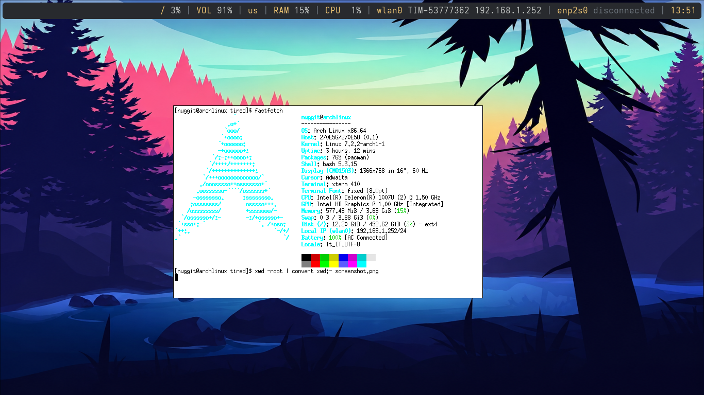

<div align="center">
<h1>Tired WM >:]</h1>
</div>


<span>

</span><br>


<p>A new window manager using Xlib. I needed to relax and i accidentaly builded a Window Manager instead :/</p>

It's aesthetically kinda cool, duh :D
## Key Features
The Modifier key is set (for default) to Mod4, which corresponds to the Super key, or for the friends the Windows key.

The default shortcuts are:
- Windows+D = App Menu
- Windows+K = Kill an app
- Thats it (for today).
  
The classic methods for taking a screenshot **will likely not work**.

In order to take a screenshot, you need to do:
```sh
xwd -root | convert xwd:- screenshot.png
```
This requires the X Applications and ImageMagick to be installed.

***Note: We encourage r/UnixP#rn users to use a compositor like picom, as Tired doesn't have a formal config file (just as dwm). However, Tired startup hooks can be set on ~/.config/tired/hooks.***
  
Tired is (and will always be) one file of C code, you'll prolly never see Tired being split in more C snippets. Thats la peace (lol).
## Building
Before compiling, we need to install dependencies, let's get that done.
_(Those dependencies have been tested exclusively for Arch, bcuz i use arch btw)_
### Dependencies
The dependencies are few but quite important;
- `rofi` (used for `rofi -show drun`)
- `polybar` (used as status bar)
- `xterm` (used as the main terminal)
- `libx11` (necessary at compile-time, not runtime)
- `xorg` (metapackage, necessary for the graphical stack, 
basically the whole point, duh)

The optional dependencies are:
- `xinit` (or xorg-xinit, necessary if ya wanna launch
tired without headaches)
- `xorg-xrandr` (necessary if ya wanna use multimonitor)
- `xosd` (makes a cool text in the bottom :])
- `ImageMagick` (screenshot in .PNG format, to use with `xwd` if you wanna take screenshots)
- `xwd` (or `xorg-xwd`, screenshot in .XWD format, to use with `ImageMagick` if you wanna take screenshots in the PNG format)

You need to have `git` and `make` (for Arch users; installing `base-devel` gives a plenty of compilation tools including `make`), aswell the C compiler (i recommend `gcc`, make sure it's aliased to `cc`) 
Here is a sample code to install dependencies on [Arch Linux](https://archlinux.org/):
```sh
sudo pacman -S --needed libx11 xorg-xinit rofi git base-devel polybar xterm xorg
```
Then you'd wanna clone the github repo:
```sh
git clone https://github.com/noxss-dev/tired.git
```
And changing directory:
```sh
cd tired-main
```
Now, you just need to compile the WM.
### Having sudo enabled
If you have sudo enabled, you can compile the WM as easily as `make`, or `sudo make clean install` (`install` must be used within `clean`)
Tip: Edit the Makefile as you like with `nano Makefile`, then `make`
### Using POSIX tools
If you don't have sudo (i encourage you to installing sudo, it's simple), you can use the _old ancient way_.
First, remember where you are with `pwd` (mentally save that as MEOW).
Then do:
```sh
[cat@iusearchbtw tired-main]$ su -
```
Do `cd MEOW` replacing MEOW with the previously took `pwd` command.
Now after all of this bs, do `make clean install` or `make`, and then `exit`.

(was not using `sudo` really worth it?k).
## Running
Since of 4th September 2026, an `.xinitrc` is  required **ONLY** for executing Tired in an X server. Hooks can be defined in the `~/.config/tired/hooks` configuration file;
```sh
#!/bin/sh
feh --bg-scale $HOME/Download/my-wallpaper.png &
polybar &
xterm &
```
How nice is that? >_<
To make sure that TiredWM will be ran, we need to use an xinitrc (still):
```sh
echo "exec tired" > ~/.xinitrc
chmod +x ~/.xinitrc
```
Else you could just:
```sh
exec tired
```
(Not tested btw)
